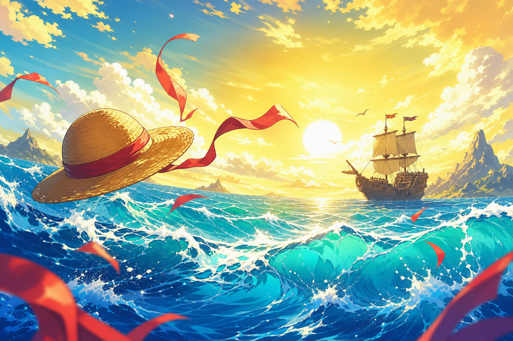
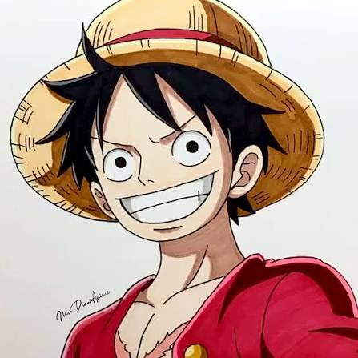

<!--
  GitHub Profile README for Abdullah Omar
  Repo must be named exactly: abdullahomar5/abdullahomar5
-->

  

    

  

   

  

  <h3>🏴‍☠️ Straw Hat Dev · Aspiring Pirate King of Code 👒</h3>

  

    <em>"It doesn't matter how strong you are — what matters is how far you're willing to go."</em>
  

  

    
    
    
  

---

## 🌊 About Me

Hey there, future nakama! I'm **Abdullah Omar** — a Computer Science student sailing the Grand Line of software development.

I build things that feel like adventures: games, tools, and systems. When I'm not writing code, you'll probably find me hyped up on One Piece arcs, dreaming of the next big project, or grinding through a tough bug like Luffy grinding through a fight.

| | |
|:--|:--|
| 🎓 **Degree** | Computer Science |
| 🏝️ **Interests** | Software Dev · Game Dev · Problem Solving · One Piece · Open Source |
| ⚔️ **Currently** | Leveling up my skills, shipping projects, and collecting coding “Devil Fruits” |
| 🎯 **Goal** | Become a developer worth of the Pirate King title — build cool stuff that helps people |
| 💬 **Ask me about** | C++, Python, game loops, or why *Gear 5* is peak fiction |

---

## 🛠️ Weapons of Choice (Languages & Tools)

  

 

| Type | Stack |
|:--|:--|
| 🗡️ **Languages** | C++ · C · Python · HTML · CSS · JavaScript |
| 🧭 **Tools** | Git · GitHub · Linux · VS Code |
| 🎮 **Fun projects** | Games, CLI tools, and whatever quest shows up next |

  

---

## 📊 Bounty Poster (GitHub Stats & Rank)

  

   

  

  🏆 Rank shows on the stats card above (S / A+ / A / B+ …) — keep coding to raise that bounty!

---

## 🗺️ Treasure Map (Featured Quests)

- 🌤️ [**weatherman**](https://github.com/abdullahomar5/weatherman) — Python weather log explorer with charts
- 🚀 [**Space-Shooter-Game**](https://github.com/abdullahomar5/Space-Shooter-Game) — Arcade action in C++
- 🛡️ [**insurance-company**](https://github.com/abdullahomar5/insurance-company) — C++ systems project
- 🚦 [**Faisal-Town-Traffic**](https://github.com/abdullahomar5/Faisal-Town-Traffic) — Traffic-related quest

---

## 🤝 Join the Crew

Want to collaborate, share ideas, or just talk One Piece theories?

- ⭐ Star a repo you like
- 🍴 Fork something and make it yours
- 📬 Reach out via GitHub

   

  

  <h3>🔥 Set sail. Write code. Become Pirate King. 🔥</h3>

  
<em>Thanks for visiting my ship — see you on the next island!</em>

  

